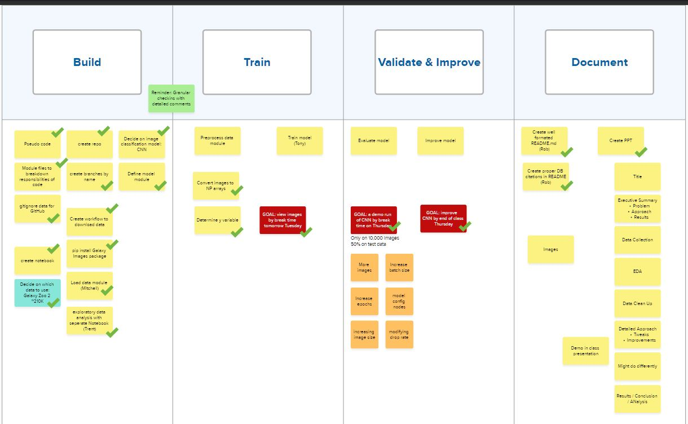

# Project 3:<p style="color:rgb(100, 10, 200);">Galaxy Zoo</p>
### **<p style="color:rgb(10, 170, 0);">Contributors:</p>**
Rob Pavlik, Mitchell Terry, Tony Montgomery, Trenton Parker

## Overview
This classroom project aims to assist in the manual classification of galaxy images by developing an image classification model. The goal is to streamline and enhance the process of analyzing galaxy images, galaxies belonging to one of six categories, reducing the reliance on manual classification methods. It is not intended to 100% replace human classifiers, instead we hope to quickly weed out images that are stars (not galaxies) or have artifacts preventing classification, and then allow humans to focus on those images that need human interpretation.



## Data
The dataset utilized for this project is sourced from [Galaxy Zoo](https://data.galaxyzoo.org/) 2, a large-scale citizen science project that provides extensive galaxy images for classification purposes.

## <p style="color:rgb(70, 100, 200);">Installation and Setup</p>
To get started with the project, ensure you have the necessary resources by following these steps:

Install the required package via the requirements.txt:
    ```sh
    pip install -r requirements.txt
    ```

Once installed and running, you can add new images to '/Resources/new_images/' and see how well the images get categorized.

## <p style="color:orange;">Acknowledgements</p>
The images used in this project came from [Galaxy Zoo](https://data.galaxyzoo.org/). These images are part of the original sample of subject images in Galaxy Zoo 2 (Willett et al. 2013, MNRAS, 435, 2835, DOI: [10.1093/mnras/stt1458](https://doi.org/10.1093/mnras/stt1458)), as identified in Table 1 of Willett et al., and also referenced in Hart et al. (2016, MNRAS, 461, 3663, DOI: [10.1093/mnras/stw1588](https://doi.org/10.1093/mnras/stw1588)).
